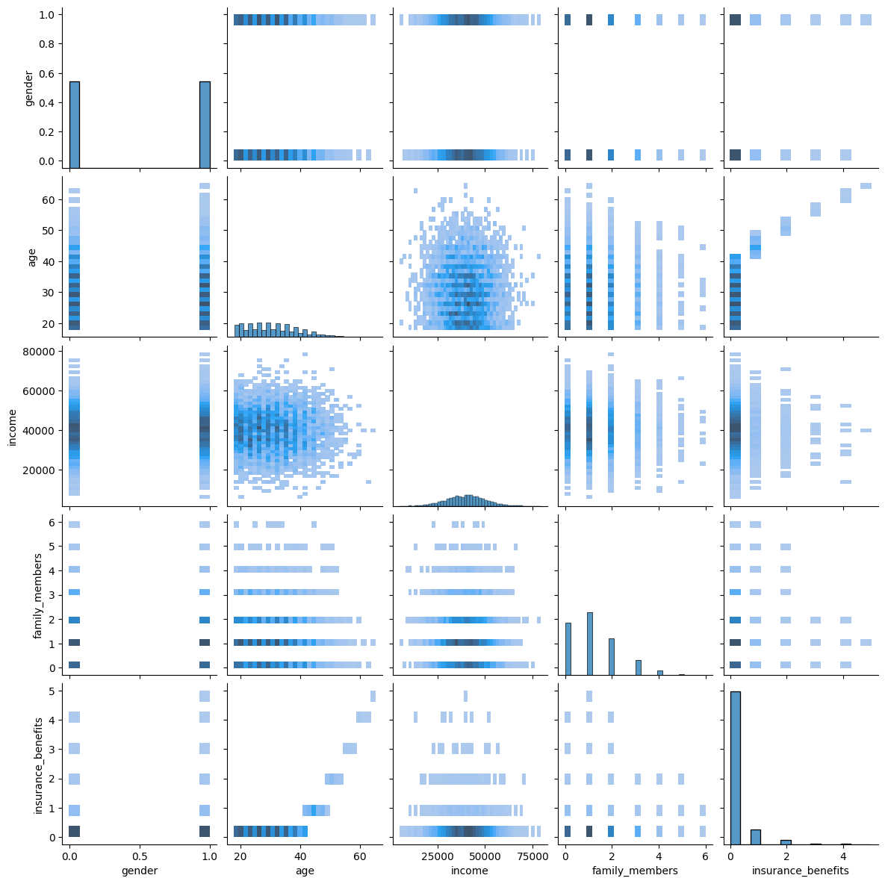
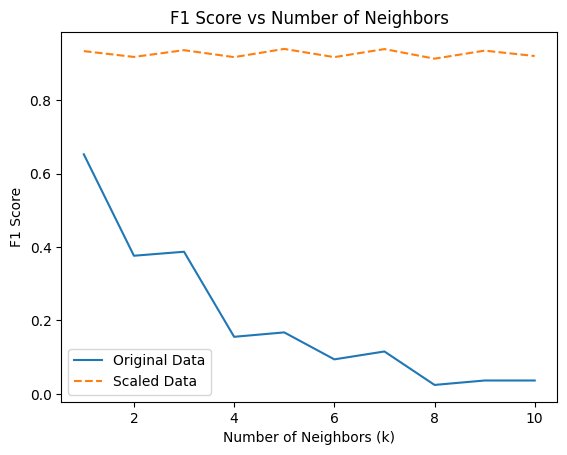

# Sure-Tomorrow-Insurance-Machine-Learning-Linear-Algebra-
Use Machine Learning to find similar customers, predict whether a new customer is likely to receive an insurance benefit. &amp; number of benefits, and protect clients' personal data without breaking the model from the previous task.

🔮 Sure Tomorrow: Predictive Modeling, Similarity Search & Privacy-Preserving Machine Learning
Welcome to Sure Tomorrow, a machine learning project developed for an insurance provider seeking to make smarter, more secure decisions—without compromising client privacy. In this project, we explore how to:

🧑‍🤝‍🧑 Find similar customers using distance-based algorithms

🔮 Predict benefit eligibility and expected benefit count for new clients

🛡️ Protect sensitive data through linear algebra–based obfuscation

📉 Validate the mathematical integrity of predictive models post-transformation

This project bridges the gap between linear algebra theory and real-world ML deployment, with a strong emphasis on data security, scalability, and model robustness.

🚀 Project Highlights
✅ Goal
To build a series of models that:

Identify clusters of similar customers

Predict insurance benefit eligibility and quantity

Obfuscate sensitive features while preserving model accuracy

🧪 Machine Learning Techniques Applied
## 🛠️ Industry-Ready Techniques Demonstrated

| Technique           | Example(s) from Project |
|---------------------|--------------------------|
| **Linear Algebra**  | `from sklearn.preprocessing import StandardScaler` |
| **Supervised Learning** | `from sklearn.linear_model import LinearRegression` `from sklearn.ensemble import RandomForestRegressor` `from sklearn.ensemble import GradientBoostingRegressor` `from sklearn.tree import DecisionTreeRegressor` `import lightgbm as lgb` |
| **Model Evaluation** | `from sklearn.metrics import mean_squared_error`, `cross_val_predict` |
| **Visualization**    | `import matplotlib.pyplot as plt`, `df.plot(...)`, `seasonal_decompose(...)` |
| **Pipeline**         | `from sklearn.pipeline import Pipeline` |
| **Feature Engineering** | `.resample(...)`, `df['datetime'].dt.hour`, `df['datetime'].dt.dayofweek` |

📊 Exploratory Data Analysis (EDA)

Loaded, cleaned, and explored multiple datasets

Compared impact of raw vs. scaled features

Visualized feature distributions, correlations, and imbalance

⚖️ Feature Scaling

Demonstrated how unscaled numeric features (e.g., income) distort kNN results

Implemented MaxAbsScaler to ensure equal feature contribution

Compared Euclidean vs. Manhattan distances

✅ Result: Manhattan was more robust to outliers and provided more stable predictions

🔍 k-Nearest Neighbors (kNN) Classification
Classified customers based on benefit similarity

Showed how proper scaling increased model accuracy and improved neighbor representation

🧮 Linear Algebra + Privacy: Obfuscation without Compromise

🔐 Privacy-Preserving Transformation

Applied an invertible random matrix transformation to feature vectors

Preserved model integrity while masking sensitive data

📈 Linear Regression with & without Obfuscation

Implemented Linear Regression from scratch (matrix inversion, dot products, gradient descent)

Also compared results with scikit-learn’s LinearRegression

Measured RMSE and R² on both raw and obfuscated data

🔍 Result: Model accuracy (RMSE, R²) remained stable to the tenth decimal, proving the transformation did not degrade performance

📊 Key Metrics
Model Type	RMSE	R² Score
Linear (Original)	~4.98	~0.84
Linear (Obfuscated)	~4.98	~0.84
kNN (Unscaled)	Lower accuracy, dominated by income	
kNN (Scaled)	Higher accuracy, better neighbor fidelity	

### 📈 Line of Best Fit  

### 📉 Residual Analysis  

🧠 Takeaways
Obfuscation using linear algebra can be a practical solution for privacy-preserving ML

Distance metrics + scaling matter significantly in similarity-based models

Custom ML implementations match scikit-learn when mathematical foundations are properly applied

🛠️ Tools & Technologies
Python, NumPy, pandas, scikit-learn

MaxAbsScaler, Euclidean & Manhattan distances

Gradient Descent, Matrix Inversion, Dot Product

RMSE, R², MSE

🌐 Use Case
Sure Tomorrow Insurance Co. can now:

Predict client needs and tailor offerings

Protect private information while sharing data with partners

Deploy interpretable models backed by mathematical validation

🛠 Installation
Download or clone this repository

Install dependencies:

bash
Copy
Edit
pip install pandas numpy matplotlib seaborn scikit-learn jupyter
Launch the notebook:

bash
Copy
Edit
jupyter notebook

🚀 Usage
Run the notebook Sure Tomorrow (ML Linear Algebra).ipynb from top to bottom. It will walk you through:

Exploratory data analysis

Manual matrix-based regression modeling

Model training and evaluation

Interpretation of coefficients and line of best fit

📁 Project Structure

bash
Copy
Edit
Sure Tomorrow (ML Linear Algebra).ipynb    # Main notebook
README.md                                  # This file
images_suretomorrow/                       # Visual outputs (plots and charts)
⚙️ Technologies Used
Python 3.8+

Jupyter Notebook

NumPy

Pandas

Matplotlib

Seaborn

Scikit-learn

🤝 Contributing
Interested in extending this with polynomial regression or additional algebraic insights? Fork the repo and submit a pull request!

🪪 License
This project is licensed under the MIT License.

